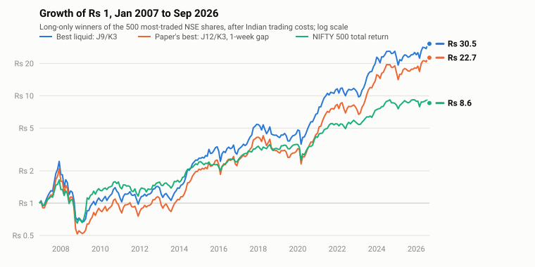

# Momentum in Indian equities: Jegadeesh and Titman (1993) on NSE shares

A replication of Jegadeesh and Titman's *Returns to Buying Winners and Selling Losers* on every share traded on India's National Stock Exchange from 2005 to 2026, including shares that were later delisted, with returns adjusted for splits, bonuses and dividends. All 32 of the paper's strategies are rebuilt, the results are compared with the paper's, and the strategies are turned into long-only portfolios that an Indian investor can actually hold, measured after Indian trading costs.

**In one line:** momentum is stronger in India than it was in the paper's US sample. The best long-only portfolio on the 500 most-traded NSE shares, ranking on 9 months of returns and holding for 3, compounded at 18.9% a year after costs over 2007–2026, 7.4 points a year more than the NIFTY 500 total return, but it fell 73% in 2008 and badly lagged the 2009 rebound.

<picture>
  <source media="(prefers-color-scheme: dark)" srcset="results/charts/growth-dark.svg">
  
</picture>

## Interactive companion

**[Open the web app](https://pramodathani.github.io/jegadeesh-titman-momentum-india/)**, written like a short paper. Choose any of the 64 portfolios and see its growth, drawdowns and calendar of monthly returns against the index, the current portfolio with weights and liquidity, the joiners and leavers in any month, the portfolio on any date since 2006, one share's history in the portfolio, the full cross-section of strategies next to the paper's Table I, and risk and turnover analytics. Every view links directly, for example [`#j12-k3-skip5-top500`](https://pramodathani.github.io/jegadeesh-titman-momentum-india/#j12-k3-skip5-top500) for the paper's best strategy.

To run it on your own computer, with no data downloads and no configuration:

```bash
pip install "git+https://github.com/pramodathani/jegadeesh-titman-momentum-india"
jt-momentum-app
```

`jt-momentum-app` serves the app at `http://127.0.0.1:8000/` and opens it in your browser. The app reads only the study's results, shipped with the package as about 9 MB of data files; the charts load Apache ECharts from a CDN, so an internet connection is needed for them.

## Headline results

Long-only winners decile of the 500 most-traded NSE shares, rebalanced monthly, after Indian delivery costs, January 2007 to September 2026 (237 months):

| Portfolio | Compound annual return | Above NIFTY 500 total return | t-statistic | Sharpe ratio | Worst fall |
|---|---|---|---|---|---|
| **J9/K3**: rank on 9 months, hold 3 | **18.9%** | **+7.4 pts** | 2.32 | 0.76 | −73% |
| J6/K3 | 18.4% | +7.0 pts | 2.30 | 0.74 | −71% |
| J12/K3 with a one-week gap, the paper's best | 17.1% | +5.6 pts | 1.91 | 0.70 | −75% |
| J6/K6, the paper's featured strategy | 16.6% | +5.1 pts | 1.91 | 0.69 | −73% |
| NIFTY 500, approximate total return | 11.5% | — | — | 0.61 | −60% |

All 64 combinations (4 ranking periods × 4 holding periods × with or without the one-week gap × two universes) are ranked in [`results/portfolio_comparison/bhavcopy_from_2005.csv`](results/portfolio_comparison/bhavcopy_from_2005.csv).

### What the Indian data says

1. **Momentum is real in India, and larger than in the paper.** Buying the top decile and shorting the bottom decile of the 500 most-traded shares earned 1.6% to 1.8% a month with a 3-month holding period, against the paper's 0.3% to 1.5%. All 32 spreads have t-statistics above 2.1.
2. **Short holding periods win.** Among the 500 most-traded shares, holding for 3 months beats holding for 6, 9 or 12 in every ranking period. In the paper this was true only for the longer ranking periods.
3. **The paper's one-week gap does not help in India.** In the US it raised returns in almost every cell, by up to 0.4 percentage points a month; on liquid Indian shares it makes little difference or lowers them slightly.
4. **Both sides contribute.** Among the 500 most-traded shares the winners decile earned 1.4% to 1.9% a month and the losers decile only 0.1% to 0.5%, against about 1.1% for the NIFTY 500, so the losers lag the market by about as much as the winners beat it.
5. **India's tax year shows up in the calendar.** The paper found a large January loss, linked to US year-end tax selling. India's financial year ends on 31 March, and the spread across all shares averaged **+4.5% in March** (t = 4.8, positive in 17 of 21 years), the mirror image of the US January effect. July is even stronger (+3.7%, t = 5.9, positive in 20 of 21 years), which the paper's explanation does not predict.
6. **No reversal among liquid shares.** In the paper, half of the first year's gain reversed over the next two years. Among the 500 most-traded NSE shares, the cumulative winners-minus-losers return keeps rising, from 12.5% at month 12 to 18.4% at month 36. Across all shares there is only a mild fade, from 13.8% to 12.0%.
7. **Momentum crashes.** Every portfolio lost 70 to 78% from December 2007 to early 2009, against about 60% for the index, and gained far less than the index in the 2009 rebound. This is the same risk the paper found in the 1930s.
8. **It worked better recently.** The long-only J9/K3 portfolio beat the index by 3.4 points a year in 2007–2016 and by 11.7 points a year in 2017–2026. Expect something nearer the long-run average than the recent past.

## The paper in brief

Narasimhan Jegadeesh and Sheridan Titman, *Returns to Buying Winners and Selling Losers: Implications for Stock Market Efficiency*, The Journal of Finance 48(1), 1993, pages 65–91 ([JSTOR](https://www.jstor.org/stable/2328882), [DOI](https://doi.org/10.1111/j.1540-6261.1993.tb04702.x)).

At the start of each month, NYSE and AMEX stocks are ranked on their return over the past J months (3, 6, 9 or 12) and split into ten equal-weighted deciles. The strategy buys the top decile, sells the bottom decile, and holds the position for K months (3, 6, 9 or 12). Because a new position starts every month, the strategy holds K overlapping positions, each with 1/K of the money. A second set of 16 strategies waits one week between ranking and buying.

Over 1965–1989 every one of the 32 strategies was profitable, the best (J12/K3 with the gap) earning 1.49% a month. The paper showed the profits were not explained by beta or by lead-lag effects between stocks, lost about 7% each January, partly reversed over the following two years, and showed up again around earnings announcements.

## What was changed for India, and why

| The paper | This study | Why |
|---|---|---|
| CRSP: every NYSE and AMEX stock, 1965–1989 | Every NSE share in series EQ, BE or BZ, 2005–2026, from NSE's daily bhavcopy files, delisted shares included | NSE's corporate action list is complete only from 2005 |
| CRSP total returns | Close-to-close returns adjusted with NSE's own list of splits, bonuses, consolidations and dividends | NSE's `PREVCLOSE` column is not adjusted for splits or bonuses, so it cannot be used directly |
| Short selling the losers | Long-short spread reported as a research measure, and long-only winners as the investable portfolio | Shares cannot be shorted overnight in India's cash market |
| Market capitalisation for size groups | Median daily traded value | Shares outstanding are not in the bhavcopy |
| All stocks | All shares, and separately the 500 most traded over the previous six months | Many Indian microcaps cannot be traded in size |
| CRSP value- and equal-weighted indices | NIFTY 500 with its dividend yield added, and an equal-weighted average of all shares | The strategy's returns include dividends, so the benchmark's should too |
| 0.5% one-way cost | Securities transaction tax, stamp duty, exchange, SEBI and GST charges at 2026 rates, plus an assumed market impact of 0.1% per side (0.3% for all shares) | Indian costs differ, and impact matters most for small shares |
| January effect | March effect | India's financial year ends on 31 March |
| Earnings announcement returns (Table IX) | Not replicated | Results dates were not available |

## Data

| Source | Covers | Used for |
|---|---|---|
| [NSE bhavcopy archive](https://www.nseindia.com/all-reports) | Daily close, previous close and traded value of every security, 1995–2026 | Share returns and liquidity |
| NSE corporate actions (`nseindia.com/api/corporates-corporateActions`) | Splits, bonuses, consolidations and dividends, complete from 2005 | Adjusting returns |
| NSE daily index files (`ind_close_all_DDMMYYYY.csv`) | Every NSE index's close and dividend yield, from July 2012 | NIFTY 500 benchmark |

The data is not included in this repository; the scripts below download it from NSE's public archives. Checks on the data found and fixed several problems that a naive replication would get wrong:

- NSE's previous close is not adjusted on an ex-date: Infosys's 1:1 bonus on 4 September 2018 shows a raw return of −48.6%.
- Corporate action descriptions come in many styles (`Bonus 6:11`, `Bonus-1:1`, `Fv Split Rs.10/- To Rs.2/`, `Agm/Final Dividend-250%`), a bonus and a split can share a day (Nazara, 26 September 2025), and some listed ex-dates are a few days off. Each split or bonus is matched to the trading day near its listed date whose price drop fits its ratio, and is applied only if it brings that day's return closer to zero.
- Some bonuses are missing from NSE's list (Mahindra & Mahindra, Wipro and Havells in 2005). These leave false falls of about 50%, which bias winners' returns down, not up.
- One-day returns below −50% or above +100% (709 of 8.6 million share-days) are treated as data errors and set to zero. Most remaining falls of 25–50% are in shares priced under Rs 2, where NSE's 5-paise price step makes −33% and −50% days common.

## Detailed results

The paper's Table I compared with India. Each cell is the average monthly return of buying the top decile and selling the bottom decile, without the gap (Panel A), with t-statistics in brackets:

| J | Paper, K=3 | Paper, K=6 | India top 500, K=3 | India top 500, K=6 | India all shares, K=3 | India all shares, K=6 |
|---|---|---|---|---|---|---|
| 3 | 0.32% (1.10) | 0.58% (2.29) | 1.62% (3.92) | 1.27% (3.48) | 0.94% (2.62) | 1.08% (3.45) |
| 6 | 0.84% (2.44) | 0.95% (3.07) | 1.68% (3.45) | 1.38% (3.01) | 1.52% (3.47) | 1.48% (3.53) |
| 9 | 1.09% (3.03) | 1.21% (3.78) | 1.75% (3.22) | 1.48% (2.89) | 1.70% (3.51) | 1.67% (3.52) |
| 12 | 1.31% (3.74) | 1.14% (3.40) | 1.72% (3.00) | 1.30% (2.41) | 1.85% (3.57) | 1.59% (3.10) |

Every table the study produces, for both universes, is in [`results/bhavcopy_from_2005/summary.md`](results/bhavcopy_from_2005/summary.md): all 32 strategies with and without the gap, decile betas and liquidity, results within liquidity groups, calendar months, five-year subperiods and event time. A quick pass on [tradingmachine](https://github.com/pramodathani/tradingmachine)'s 2019–2026 broker prices, which cover only shares listed today, is in [`results/tradingmachine/summary.md`](results/tradingmachine/summary.md) as a cross-check.

## Caveats

- **The best of 64 backtests is partly luck.** With 64 strategies tested, a single one needs a t-statistic of about 3.2 to rule out chance, and the best liquid portfolio's lead over the index has a t-statistic of 2.3. The stronger evidence is that all 32 liquid long-only portfolios beat the index after costs, by 1.2 to 7.4 points a year, and that returns vary smoothly with J and K.
- **Costs are partly assumed.** Market impact is an assumption, and the fixed depository charge of about Rs 16 per share sold is not included; it matters below about Rs 15 lakh of capital.
- **The benchmark is approximate.** NSE's NIFTY 500 Total Return Index was not available in a scriptable archive, so the price index plus its reported dividend yield is used; before July 2012 the later years' average yield is assumed.
- **No risk-free rate.** Alphas are market-model intercepts; this makes no difference for the long-short spread.
- **Survivorship and corporate actions are handled, but not perfectly.** Renamed shares are treated as delisted and relisted, and rights issues and demergers are not adjusted.

## Reproducing the results

Python 3.11 or later. From a clone of this repository:

```bash
python -m venv .venv
.venv/bin/pip install -e ".[test]"

.venv/bin/python -m jegadeesh_titman_india.scripts.download_bhavcopy --start 1995-01-01   # about 8,000 files, an hour
.venv/bin/python -m jegadeesh_titman_india.scripts.build_bhavcopy_store                   # also fetches corporate actions
.venv/bin/python -m jegadeesh_titman_india.scripts.download_index_history                 # NIFTY 500 from July 2012
.venv/bin/python -m jegadeesh_titman_india.scripts.run_study                              # the paper's tables, 2005-2026
.venv/bin/python -m jegadeesh_titman_india.scripts.compare_portfolios                     # the 64 long-only portfolios
.venv/bin/python -m jegadeesh_titman_india.scripts.draw_readme_charts
.venv/bin/python -m jegadeesh_titman_india.scripts.build_snapshot                         # the web app's data
.venv/bin/python -m pytest
```

Without the author's tradingmachine index cache the benchmark starts in July 2012, so comparisons against the NIFTY 500 cover a shorter period than shown here; the equal-weighted market built from the bhavcopy itself covers the whole sample.

## Trading it live (optional)

The `live` package turns any of the 64 strategies into a [tradingmachine](https://github.com/pramodathani/tradingmachine) portfolio and rebalances it monthly through tradingmachine's Unified Broker Interface: each strategy keeps its own book of holdings, sells before it buys, and records what actually filled. It needs `pip install -e ".[live]"` and a running Unified Broker Interface, and it places real orders, so it is a dry run unless `--execute` and `--confirm <strategy name>` are both given. See `src/jegadeesh_titman_india/scripts/run_live_portfolio.py`. [`tradingmachine_gaps.md`](tradingmachine_gaps.md) lists what the library lacked for this study.

This is research, not investment advice. Momentum portfolios can lose most of their value in a crash.

## Repository layout

```
src/jegadeesh_titman_india/
├── bhavcopy/         downloading and parsing NSE bhavcopies, corporate actions and index files
├── momentum/         monthly returns, deciles, overlapping portfolios, costs, statistics, the study and the charts
│   └── price_sources/   bhavcopy and tradingmachine daily returns
├── live/             strategy specifications, targets, books, fills and rebalancing (optional)
├── site/             the web app: index.html, app.js, style.css and its data snapshot
├── site_server.py    the jt-momentum-app command
└── scripts/          the command-line programs above
tests/                unit tests on small made-up data with known answers
results/              the tables, the 64-portfolio comparison and the charts
.claude/notes/        notes on the reasoning behind individual source files
```

## Citation

If you use this work, please cite the original paper and this repository; GitHub's "Cite this repository" button gives the details from [`CITATION.cff`](CITATION.cff). Licensed under the [MIT licence](LICENSE).
